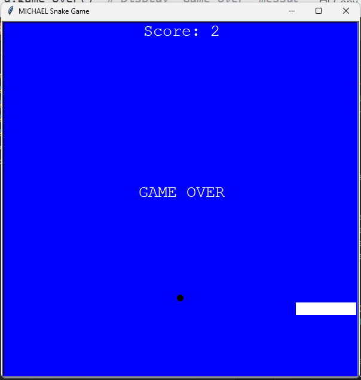
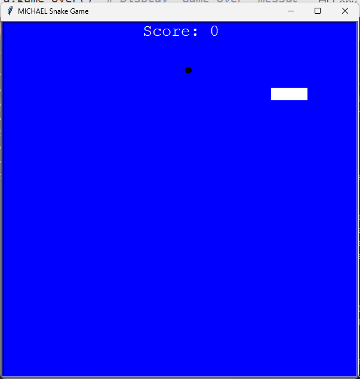

# Snake Game

## Overview
This is a simple Snake game built using Python's `turtle` module. The objective of the game is to control the snake using arrow keys, eat food to grow, and avoid collisions with the walls or itself. The game ends when the snake collides with the wall or its own body.

## Features
- Classic snake movement (up, down, left, right)
- Food randomly appearing on the screen
- Score tracking
- Game over detection when the snake hits a wall or itself

## Installation
To run the game, ensure you have Python installed on your system. You can install the necessary dependencies using:

```bash
pip install turtle
```

## How to Play
1. Run the `main.py` script:
   ```bash
   python main.py
   ```
2. Use the arrow keys to move the snake:
   - **Up Arrow**: Move up
   - **Down Arrow**: Move down
   - **Left Arrow**: Move left
   - **Right Arrow**: Move right
3. Eat the food to grow longer and increase your score.
4. Avoid running into the walls or your own tail.
5. The game ends when the snake collides with itself or the walls.

## File Structure
```
|-- main.py        # Main game loop
|-- snake.py       # Snake class (movement and growth)
|-- food.py        # Food class (random food placement)
|-- scoreboard.py  # Scoreboard class (score tracking and game over message)
```

## Game Logic
- The game continuously updates the snake's position using a `while` loop.
- The `food.py` module generates food at random positions.
- The `scoreboard.py` module keeps track of the player's score.
- The game ends if the snake collides with a wall or itself.

## Future Improvements
- Adding different levels of difficulty.
- Enhancing the UI with a better design.
- Implementing a high score tracking system.
### Game Over Screen


### Initial Game Screen

Enjoy playing the Snake Game! 🐍

